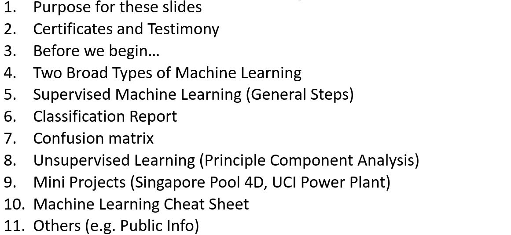
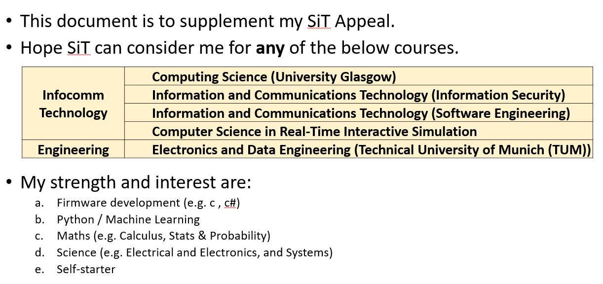

# Agenda

# Purpose for these Slides

# Certificates - Business Courses
# Certificates - Machine Learning Course
# Certificates - Python Data Structures, Algorithm and Interviews, Web Development Bootcamp 2021
# Testimony
# Before We Begin
# Two Broad Types of Machine Learning

> data = pd.read_csv('Breast Cancer.csv')
> 
> df   = pd.DataFrame(data)
> 
> print(df.info())                    
> 
> print(df.head(5))
