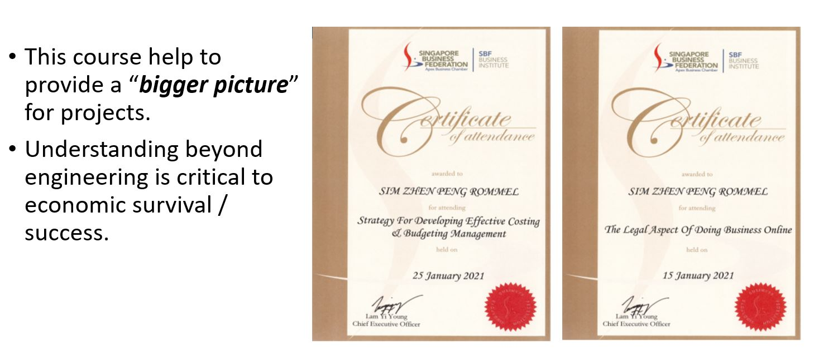
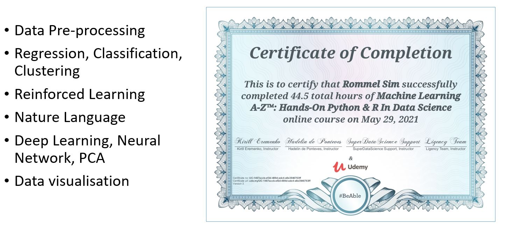
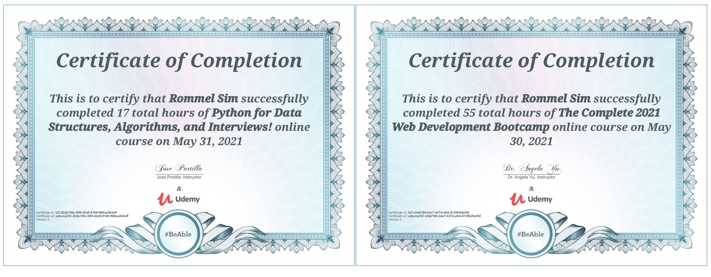
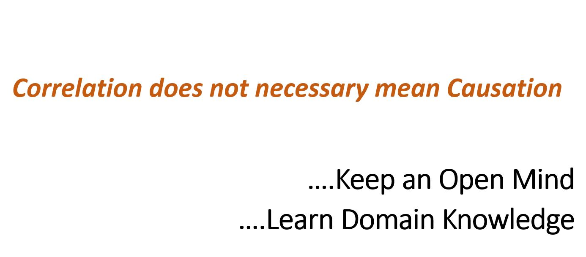
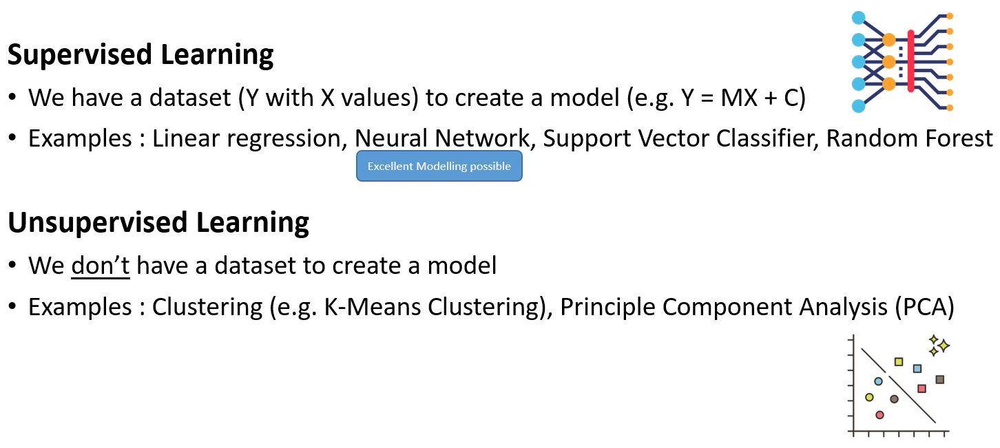
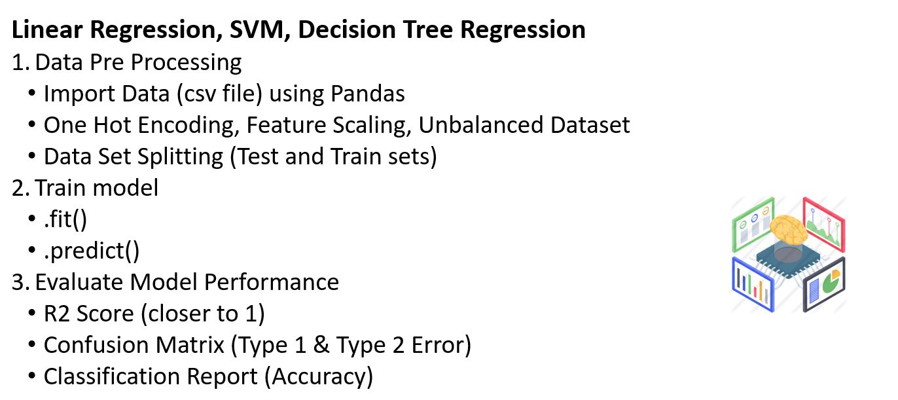
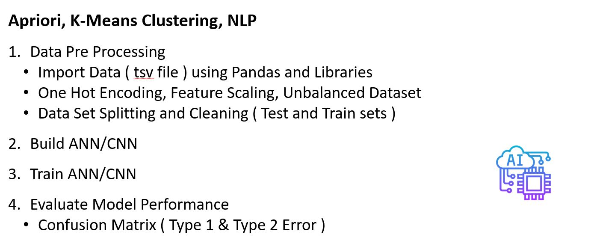
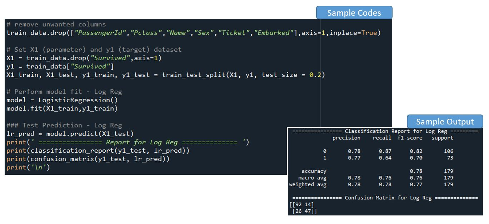

# Agenda

# Purpose for these Slides

# Certificates - Business Courses

# Certificates - Machine Learning Course

# Certificates - Python Data Structures, Algorithm and Interviews, Web Development Bootcamp 2021

# Testimony

# Before We Begin

# Two Broad Types of Machine Learning

# Supervised Machine Learning (General Steps)

# Unsupervised Machine Learning (General Steps)

# May Sample Codes for Supervised Learning

# Classification Report (Precision vs Recall, and F1-Score)
# Classification Report
# Compare Results (Neural Network adn Log Reg)
# Confusion Matrix (2x2 Matrix)
# Unsupervised Learning (PCA)
# Mini Project1 : Singapore Pools (4D)
# Mini Project1 : Singapore Pools (4D)
# Mini Project2 : Sample Codes on Models
# Mini Project2 : Outputs
# Machine Learning Cheat Sheet
